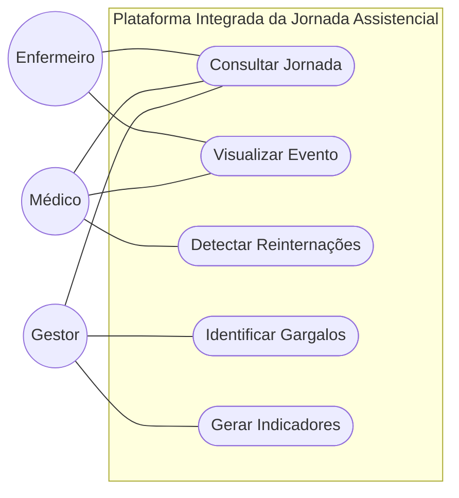

# Modelagem de Casos de Uso

## 1. Diagrama de Casos de Uso

---

# 2. Especificação dos Casos de Uso

## UC001 - Consultar Jornada

* **Ator**: Gestor, Médico, Enfermeiro.
* **Fluxo**:
Selecionar paciente → Consultar eventos assistenciais → Ordenar cronologicamente → Exibir linha do tempo.

### [CARE-UC001] Implementação da Consulta da Jornada

* **Context**:
Eventos clínicos previamente armazenados no sistema.

* **Action**:
Implementar mecanismo de reconstrução cronológica da jornada utilizando timestamps dos eventos.

* **Result**:
Sistema exibe a trajetória completa do paciente contendo consultas, exames, internações, procedimentos e altas.

* **Evaluation**:
Validar ordenação correta dos eventos e exibição consistente da timeline.

---

## UC002 - Visualizar Evento

* **Ator**: Médico, Enfermeiro.
* **Fluxo**:
Selecionar evento → Consultar detalhes → Exibir informações clínicas.

### [CARE-UC002] Implementação da Visualização de Eventos

* **Context**:
Evento existente dentro da jornada do paciente.

* **Action**:
Implementar painel detalhado para visualização das informações do evento assistencial.

* **Result**:
Sistema apresenta:
- data,
- horário,
- unidade,
- especialidade,
- procedimento,
- profissional responsável.

* **Evaluation**:
Validar carregamento correto das informações do evento selecionado.

---

## UC003 - Detectar Reinternações

* **Ator**: Médico.
* **Fluxo**:
Selecionar paciente → Consultar histórico → Verificar recorrências → Exibir reinternações identificadas.

### [CARE-UC003] Implementação da Detecção de Reinternações

* **Context**:
Histórico assistencial disponível no banco de dados.

* **Action**:
Implementar mecanismo de identificação automática de reinternações em intervalo configurável.

* **Result**:
Sistema identifica recorrências e sinaliza pacientes com múltiplas admissões.

* **Evaluation**:
Executar testes utilizando jornadas simuladas com reinternações conhecidas.

---

## UC004 - Identificar Gargalos

* **Ator**: Gestor.
* **Fluxo**:
Selecionar período → Processar jornadas → Calcular tempos médios → Identificar gargalos operacionais.

### [CARE-UC004] Implementação da Identificação de Gargalos

* **Context**:
Base histórica de jornadas assistenciais disponível.

* **Action**:
Implementar análise dos tempos entre eventos e permanência nas unidades.

* **Result**:
Sistema identifica etapas com atrasos, filas excessivas e tempos acima do esperado.

* **Evaluation**:
Validar identificação correta dos gargalos em cenários simulados e históricos.

---

## UC005 - Gerar Indicadores

* **Ator**: Gestor.
* **Fluxo**:
Selecionar filtros → Processar métricas → Gerar dashboard → Exibir indicadores.

### [CARE-UC005] Implementação dos Indicadores Assistenciais

* **Context**:
Jornadas previamente processadas e armazenadas.

* **Action**:
Implementar cálculo automático de indicadores operacionais e clínicos.

* **Result**:
Sistema apresenta:
- tempo médio de permanência,
- tempo de espera,
- taxa de reinternação,
- fluxo predominante,
- ocupação por unidade.

* **Evaluation**:
Validar precisão dos cálculos utilizando conjuntos de dados controlados.