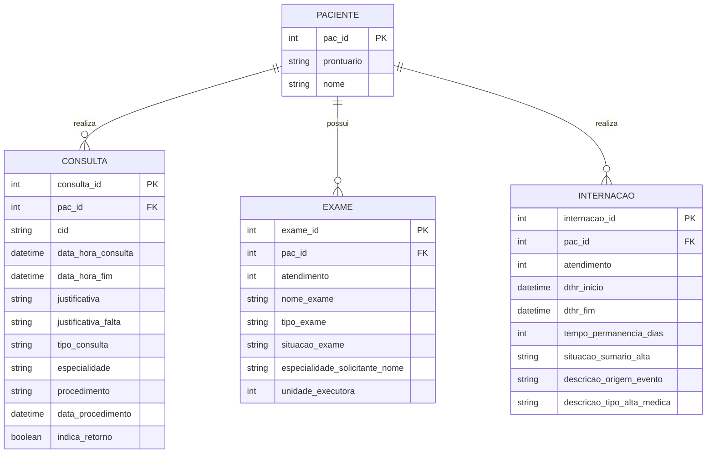

# Modelo de Dados e Dicionário

## 1. Modelo Entidade-Relacionamento



## 2. Dicionário de Dados
* Tabela PACIENTES, PRONTUARIOS, etc.

### [SCHEMA] Esquema JSON - Paciente
```json
{
  "$schema": "http://json-schema.org/draft-07/schema#",
  "title": "Paciente",
  "type": "object",
  "properties": {
    "pac_id": { "type": "integer" },
    "prontuario": { "type": "string", "minLength": 1 },
    "nome": { "type": "string", "minLength": 3 }
  },
  "required": ["pac_id", "prontuario", "nome"]
}
```

## 3. Regras de Integridade
* Os dados recebidos do AGHU para pacientes, consultas, exames e internações devem seguir estritamente o conjunto de colunas definido neste modelo.
* Logs obrigatórios e proibição de exclusão física.

## 4. Esquema de Métricas (Metrics-First)

O sistema persiste apenas métricas derivadas e metadados necessários para análise e visualização. Não persistir PII ou texto livre contendo informações clínicas sensíveis.

METRICA {
        int metrica_id PK
        int pac_codigo?  # opcional: referência pseudonimizada ao paciente (não CPF)
        string tipo_metrica
        numeric valor
        datetime dthr
        json contexto  # JSON com metadados (unidade, especialidade, evento_origem, atendimento_id opcional)
}

### [SCHEMA] Esquema JSON - Metrica
```json
{
    "$schema": "http://json-schema.org/draft-07/schema#",
    "title": "Metrica",
    "type": "object",
    "properties": {
        "metrica_id": { "type": "integer" },
        "pac_codigo": { "type": ["integer", "null"] },
        "tipo_metrica": { "type": "string" },
        "valor": { "type": "number" },
        "dthr": { "type": "string", "format": "date-time" },
        "contexto": { "type": "object" }
    },
    "required": ["metrica_id","tipo_metrica","valor","dthr"]
}
```

As integrações com AGHU devem transformar eventos clínicos em métricas antes de persistência na plataforma.
