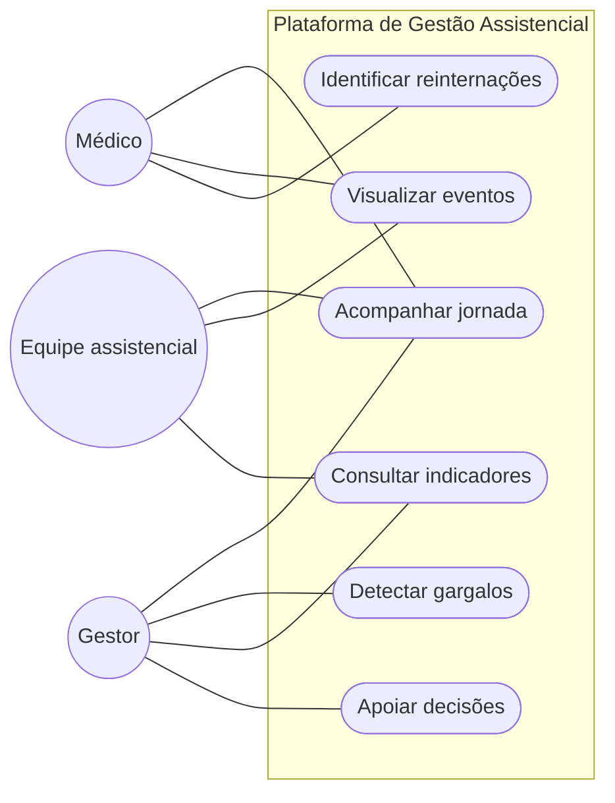

# Modelagem de Casos de Uso

## 1. Visão Geral dos Casos de Uso

O sistema foi pensado para apoiar a gestão assistencial, oferecendo uma visão clara da jornada do paciente e dos pontos que demandam atenção operacional. Os casos de uso abaixo priorizam a compreensão do fluxo de cuidado, a identificação de gargalos e a geração de indicadores úteis para gestores, equipes clínicas e analistas.

---

## 2. Especificação dos Casos de Uso

## UC001 - Acompanhar a jornada do paciente

* **Ator**: Gestor, Médico, Equipe assistencial.
* **Objetivo**: Permitir a visualização da trajetória do paciente ao longo do atendimento.
* **Fluxo**: Selecionar paciente → consultar eventos assistenciais → ordenar cronologicamente → visualizar linha do tempo.

### Valor para a gestão
Acompanhar a jornada ajuda a compreender como o paciente circula entre consultas, exames, internações e procedimentos, facilitando a identificação de atrasos e de pontos de ruptura no cuidado.

---

## UC002 - Visualizar detalhes de cada evento

* **Ator**: Médico, Equipe assistencial.
* **Objetivo**: Fornecer contexto clínico e operacional sobre cada etapa do cuidado.
* **Fluxo**: Selecionar evento → consultar detalhes → analisar informações relevantes.

### Valor para a gestão
A visualização detalhada favorece a comunicação entre os profissionais e melhora a compreensão do que aconteceu em cada etapa da assistência.

---

## UC003 - Identificar reinternações e recorrências

* **Ator**: Médico, Gestor.
* **Objetivo**: Destacar pacientes com múltiplas internações ou retornos no mesmo ciclo assistencial.
* **Fluxo**: Selecionar paciente → revisar histórico → identificar recorrências → sinalizar eventos relevantes.

### Valor para a gestão
Esse caso de uso ajuda a reconhecer padrões de recorrência e pode indicar necessidade de revisão do plano terapêutico ou de reorganização do fluxo de atendimento.

---

## UC004 - Detectar gargalos operacionais

* **Ator**: Gestor.
* **Objetivo**: Identificar atrasos e pontos críticos no fluxo de atendimento.
* **Fluxo**: Selecionar período → analisar jornadas → comparar tempos → localizar gargalos.

### Valor para a gestão
A identificação de gargalos permite agir sobre filas, tempos de espera e pontos de estrangulamento, com impacto direto na capacidade de resposta do hospital.

---

## UC005 - Consultar indicadores de desempenho assistencial

* **Ator**: Gestor, Analista, Lideranças clínicas.
* **Objetivo**: Apresentar indicadores que apoiem a tomada de decisão.
* **Fluxo**: Selecionar filtros → processar métricas → exibir dashboard → interpretar resultados.

### Valor para a gestão
Os indicadores ajudam a monitorar o acesso, a continuidade do cuidado, a utilização de recursos e o desempenho das unidades, oferecendo base para priorização de ações.

---

## UC006 - Apoiar decisões de gestão

* **Ator**: Gestor, Analista.
* **Objetivo**: Transformar dados em informação útil para planejamento e acompanhamento.
* **Fluxo**: Escolher período, especialidade ou unidade → consultar indicadores → comparar cenários → definir ações.

### Valor para a gestão
Esse caso de uso conecta os dados do sistema à rotina de gestão, permitindo acompanhar tendências, comparar unidades e apoiar decisões com mais segurança.
